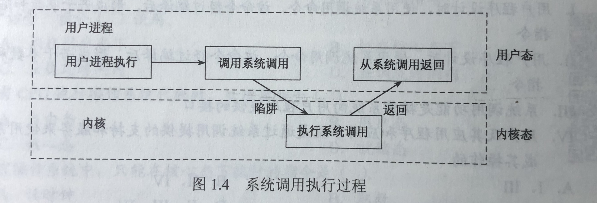

[toc]

# 1.运行机制

通常CPU执行两种不同性质的程序，一种是操作系统的内核程序；另一种是用户自编程序(即系统外层的应用程序)。对于操作系统，前者是后者的管理者，因此管理程序(即内核程序)要执行一些特权指令，而用户自编程序则不能执行这些指令。

**特权指令：**指计算机中不允许用户直接使用的指令，如I/O指令，置中断指令，存取用于内存保护的寄存器，送程序状态字到程序状态字寄存器的指令。

CPU的状态划分为用户态(目态)和核心态(管态，内核态)。操作系统内核程序运行在核心态。

# 2.内核

内核是计算机上配置的底层软件，是计算机功能的延伸。

内核包含4个方面：

**1.时钟管理**

时钟是最关键的设备。第一功能是计时，操作系统需要通过时钟管理，向用户提供标准的系统时间。通过时钟中断的管理，可以实现进程的切换。例如：在分时操作系统中采用时间片轮转调度，在实时系统中按截止时间控制运行，在批处理系统中通过时钟管理来衡量一个作业的运行程序等。

**2.中断机制**

引入中断技术的初衷是提高多道程序运行环境中CPU的利用率。中断机制中，只有一小部分功能属于内核，它们负责保护和恢复中断现场的信息，转移控制权到相关的处理程序。

**3.原语**

底层必然是一些可被调用的公用小程序。

特点如下：

1. 处于操作系统的最低层，是最接近硬件的部分。
2. 运行具有原子性，其操作只能一气呵成，即运行时不能被中断。
3. 运行时间较短，且调用频繁。

把具有这些特点的程序称为原语。定义原语的直接方法是关闭中断，让其所有动作不可分割地完成后再打开中断。

**4.系统控制的数据结构及处理**

系统中用来登记状态信息的数据结构很多，如作业控制块，进程控制块(PCB),设备控制块等。

# 3.中断和异常

CPU从用户态进入核心态的唯一途径就是通过中断或异常。这时通过硬件实现的(例如，用一个特殊的寄存器的一位来表示CPU所处的状态。0表示核心态，1表示用户态)。

### 1.定义

中断，指来自CPU执行指令之外的事件的发生，如设备发出的I/O结束中断，表示设备输入/输出处理已经完成，希望处理机能够向设备发下一个输入/输出请求，同时让完成输入/输出后的程序继续运行。又如时钟中断。这一类中断通常是与当前指令执行无关的事件。

异常，称为内中断或陷入。指源自CPU执行指令内部的事件，如程序的非法操作码，地址越界，算术溢出。对异常的处理一般要依赖于当前程序的运行现场，而且异常不能被屏蔽，一旦出现要立即处理。

### 2.中断处理的过程

恢复现场是指再中断返回前，必须将寄存器的内容恢复到中断处理前的状态，这部分由中断服务程序完成。

# 4.系统调用

系统调用，即用户再程序中调用操作系统所提供的一些子功能，系统调用可视为特殊的公共子程序。在用户程序中，凡是与资源有关的操作(如存储分配，进行O/I传输及管理文件等)，都必须通过系统调用的方式向操作系统提出服务请求，并由操作系统代为完成。

大致分为如下几类：

1. 文件管理
2. 设备管理
3. 进程控制
4. 进程通信
5. 内存管理

系统调用对整个系统的影响非常大，因此必定需要使用某些特权指令才能完成，所以系统调用的处理需要由操作系统内核程序负责完成，要运行在核心态。用户程序可以执行陷入指令(trap指令或访管指令)来发起系统调用，请求操作系统提供服务。可以这么理解：用户程序执行“陷入指令”相当于把CPU的使用权交给操作系统内核程序(CPU状态会从用户态进入核心态)，之后操作系统内核程序再对系统调用请求做出相应处理。处理完后，操作系统内核程序又会把CPU的使用权还给用户程序(即CPU的状态从核心态回到用户态)。目的是：用户程序不能直接执行对系统影响非常大的操作，必须通过系统调用的方式请求操作系统代为执行，以便保证系统的稳定性和安全性，防止用户程序随意更改或访问重要的系统资源，影响其他进程的运行。

操作系统运行环境：用户通过操作系统运行上层程序(如系统提供的命令解释程序或用户自编程序)，而上层程序的运行依赖于操作系统的底层管理程序提供服务支持，当需要管理程序服务时，系统则通过硬件中断机制进入核心态，运行管理程序；也可能是程序运行出现异常情况，被动地需要管理程序的服务，这时就需要异常处理来进入核心态。

下面列举由用户态转向核心态的例子：

1. 用户程序要求操作系统的服务，即系统调用。
2. 发生一次中断
3. 从核心态转向用户态由一条指令实现，这条指令也是特权指令，一般是中断返回指令。

**注意：由用户态进入核心态，不仅状态需要切换，而且所用的堆栈也可能需要由用户堆栈切换为系统堆栈，但这个系统堆栈也是属于该进程的。**

**若程序的运行由用户态转到核心态，则会用到访管指令，访管指令是在用户态使用的，所以不可能是特权指令**

## 2.访管指令与访管中断

访管指令是一条可以在用户态下执行的指令。在用户程序中，因要求操作系统提供服务而有意识地使用访管指令，从而产生一个中断事件(自愿中断)，将操作系统转换为核心态，称为访管中断。访管中断由访管指令产生，程序员使用访管指令向操作系统请求服务。

**访管指令本身不是特权指令**,其基本功能是让程序拥有“自愿进管”的手段，从而引起访管中断。