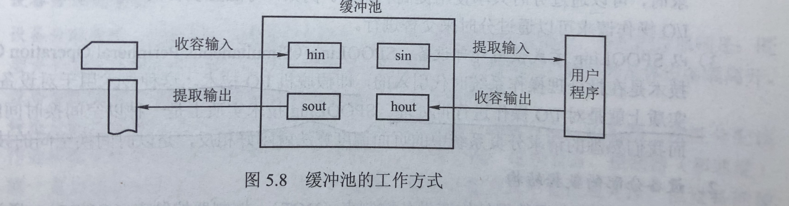

## IO 子系统

由于I/O设备众多，功能和传输速率差异巨大，因此需要多种方式来进行设别控制。这些方法组成了操作系统内核的I/O子系统。

提供的服务有：I/O调度，缓冲与高速缓存，设备分配与回收，假脱机，设备保护和差错处理。

## 高速缓存与缓冲区

#### 1.磁盘高速缓存

操作系统中使用磁盘高速缓存技术来提高磁盘的I/O速度。

磁盘高速缓存逻辑上属于磁盘，物理上则是驻留在内存中的盘块。

#### 2.缓冲区

目的：

1. 缓和CPU与I/O设备间速度不匹配的矛盾。
2. 减少对CPU的中断频率，放宽对CPU中断响应时间的限制。
3. 解决基本数据单元大小(即数据粒度)不匹配的问题
4. 提高CPU和I/O设备之间的并行性。

缓冲区位于内存区域。

缓冲区有一个特点：即当缓冲区的数据非空时，不能往缓冲区冲入数据，只能从缓冲区把数据传出；当缓冲区为空时，可以往缓冲区冲入数据，但必须把缓冲区充满后，才能从缓冲区把数据传出。 		(进程通信中的管道通信也类似）

##### 缓冲池

由多个系统公用的缓冲区组成，缓冲区按其使用状况可以形成三个队列：

空缓冲队列，装满输入数据的缓冲队列(输入队列)和装满输出数据的缓冲队列(输出队列)。

还应具有4种缓冲区：

用于收容输入数据的工作缓冲区，用于提取输入数据的工作缓冲区，用于收容输出数据的工作缓冲区及用于提取输出数据的工作缓冲区。

当输入进程需要输入数据时，便从空缓冲队列的队首摘下一个空缓冲区，把它作为收容输入工作缓冲区，然后把输入数据输入其中，装满后再将它挂到输入队列队尾。当计算进程需要输入数据时，便从输入队列取得一个缓冲区作为提取输入工作缓冲区，计算进程从中提取数据，数据用完后再将它挂到空缓冲队列尾。当计算进程需要输出数据时，便从空缓冲队列的队首取得一个空缓冲区，作为收容输出工作缓冲区，当其中装满输出数据后，再将它挂到输出队列队尾。当要输出时，由输出进程从输出队列中取得一个装满输出数据的缓冲区，作为提取输出工作缓冲区，当数据提取完后，再将它挂到空缓冲队列的队尾。