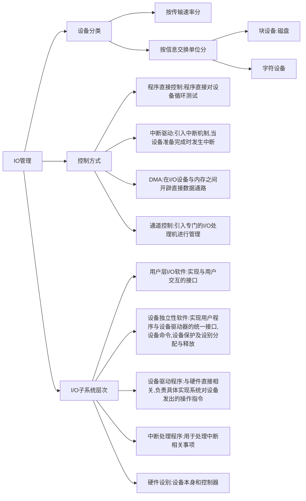
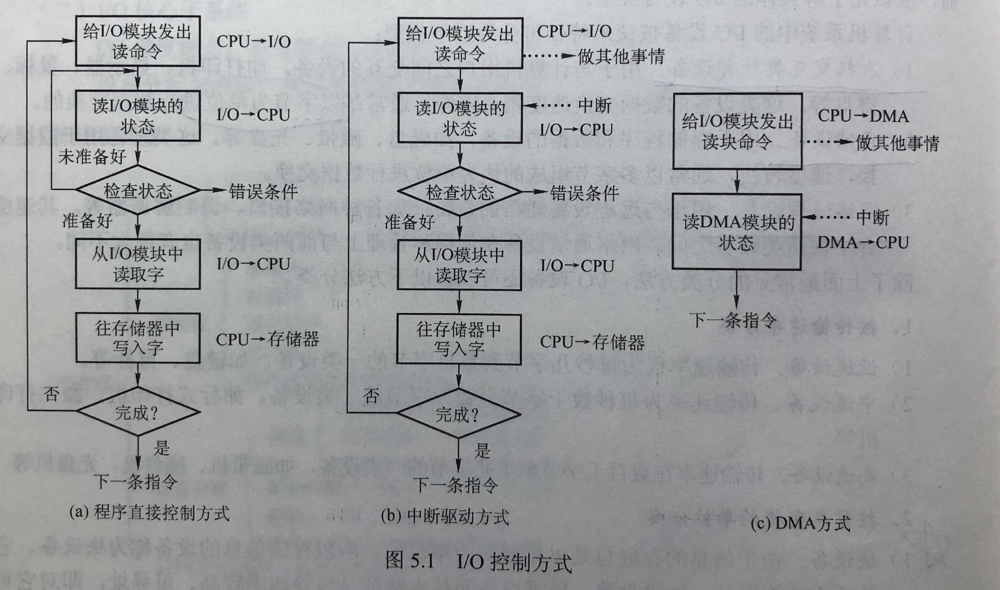
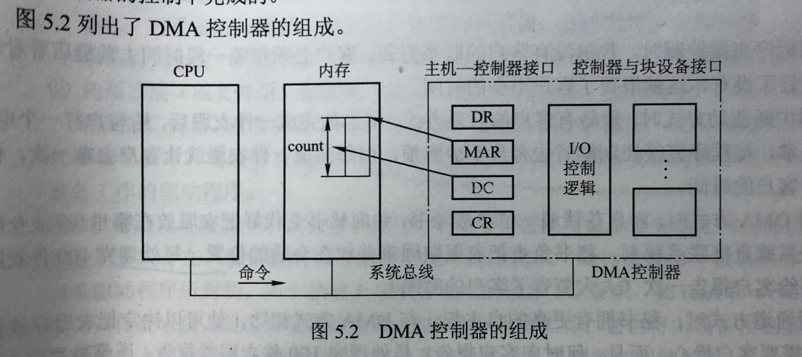

## 1.概述

## 2. I/O设备

* 块设备：如磁盘等。基本特征是：传输速率较高，可寻址。
* 字符设备

## 3. I/O控制方式

####  D M A 方式

特点：

1. 基本单位是数据块
2. 所传送的数据，是从设备直接送入内存的，或者相反
3. 仅在传送一个或多个数据块的开始和结束时，才需要CPU干预，整块数据的传送是在D M A控制器的控制下完成的

D M A方式主要用于块设备，磁盘是典型的块设备。

D M A控制器中的4类寄存器：

1. 命令/状态寄存器(CR)：控制D M A的工作模式并给CPU反映它当前的状态
2. 内存地址寄存器(MAR)：存放D M A作业时的源地址和目的地址
3. 数据寄存器(DR)：存放要D M A转移的数据
4. 数据计数器(DC)

D M A 的工作方式：

CPU接收到I/O设备的D M A请求时，他给I/O控制器发出一条指令，启动D M A控制器，然后继续其他工作。之后CPU将控制操作委托给D M A控制器，由该控制器负责，直接与存储器交互，传送整个数据块，每次传送一个字，**这个过程不需要CPU的参与**。传送完成后，D M A控制器发送一个中断信号给处理器。**因此只有在传送开始和结束时才需要CPU的参与**

####  通道控制方式

I/O通道是指专门负责输入/输出的处理机。

I/O通道与一般处理机的区别是：通道指令类型单一，没有自己的内存，通道所执行的通道程序是放在主机的内存中的，也就是通道与CPU共享内存。

I/O通道与D M A方式的区别是：D M A方式需要CPU来控制传输的数据块大小，传输的内存位置，而通道方式中这些信息是由通道控制的。

#### 一些注意点

1. 分配共享设备是不会引起进程死锁的。

2. 接口用来传输信号，I/O逻辑即设备控制器，用来实现对设备的控制。

3. 通道用于完成内存和外设的信息交换。

4. 通道是一种特殊的处理器，所以属于硬件技术。SPOOLing，缓冲池，内存覆盖都是在内存的基础上通过软件实现的。

5. 键盘是典型的通过中断I/O方式工作的外设，当用户输入信息时，计算机响应中断并通过中断处理程序获得输入信息。

6. I/O软件一般从上到下分成4个层次：用户层，与设备无关的软件层，设备驱动程序及中断处理程序。与设备无关的软件层也就是系统调用的处理程序。

   当用户使用设备时，首先在用户程序中发起一次系统调用，操作系统的内核接到该调用请求后，请求调用处理程序进行处理，再转到相应的设备驱动程序，当设备准备好或所需数据到达后，设备硬件发出中断，将数据按上述调用顺序逆序向回传到用户程序中。

7. 计算磁盘号，磁头号和扇区号的工作是由设备驱动程序完成的。

8. I/O管理要完成哪些功能？

   状态跟踪：能实现实时掌握外部设备的状态

   设备存取：实现对设备的存取操作

   设备分配：在多用户环境下，负责设备的分配与回收

   设备控制：包括设备的驱动，完成和故障的中断处理。

