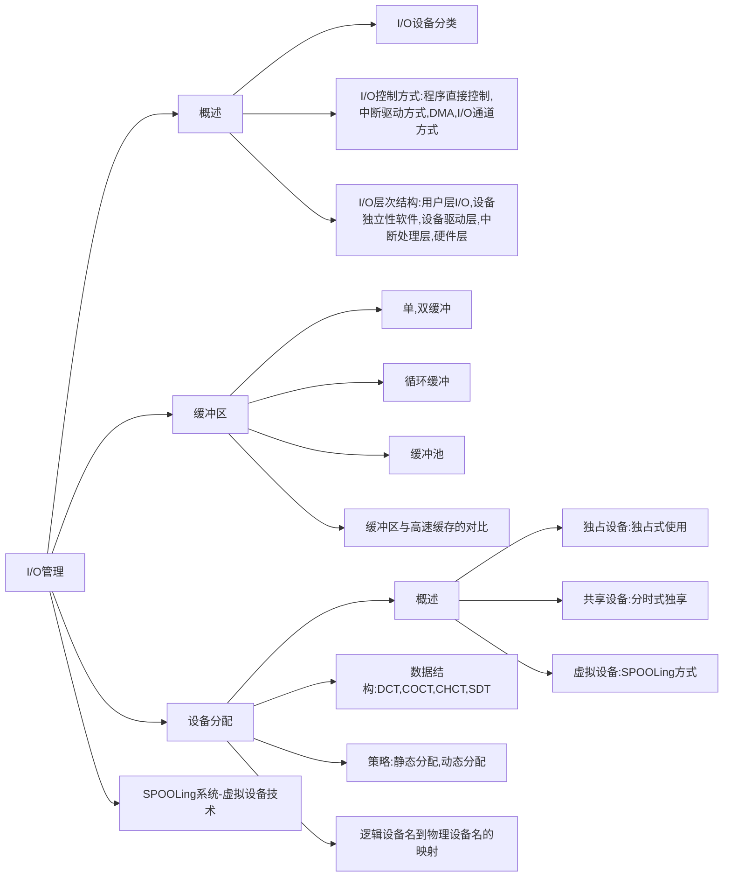

```mermaid
graph LR
A[I/O管理]--> B[概述]
B-->b[I/O设备分类]
B-->bb[I/O控制方式:程序直接控制,中断驱动方式,DMA,I/O通道方式]
B-->bbb[I/O层次结构:用户层I/O,设备独立性软件,设备驱动层,中断处理层,硬件层]

A-->C[缓冲区]
C-->c[单,双缓冲]
C-->cc[循环缓冲]
C-->ccc[缓冲池]
C-->cccc[缓冲区与高速缓存的对比]

A-->D[设备分配]

D-->dd[概述]

dd-->e[独占设备:独占式使用]
dd-->ee[共享设备:分时式独享]
dd-->eee[虚拟设备:SPOOLing方式]
D-->E[数据结构:DCT,COCT,CHCT,SDT]
D-->F[策略:静态分配,动态分配]
D-->G[逻辑设备名到物理设备名的映射]

A-->H[ SPOOLing系统-虚拟设备技术]
```

